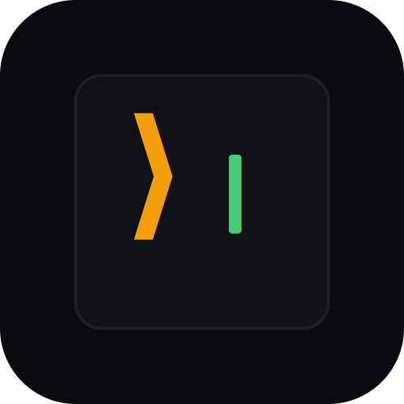

<div align="center">



# Agent Studio

**A dashboard for managing Claude Code sessions, agent teams, and automated workflows.**

[](LICENSE)
[](https://www.typescriptlang.org)
[](https://nodejs.org)

</div>


## Why

Claude Code is powerful. You open a terminal, start a session, and it writes real code for you.

But the moment you go beyond a single session, things fall apart:

1. **You're stuck between terminals.** You have a frontend agent in one tab, a backend agent in another, QA in a third. They can't see each other's work. You're the human router, copy-pasting context between them.

2. **Nothing carries over.** Every new session starts from zero. That thing your agent figured out yesterday about your API — gone. You explain the same context over and over.

3. **Complex tasks need coordination, not just prompts.** "Scan the codebase, design the solution, build it, test it, review for security, then ship" — you can't do that in a single terminal session. You need steps, checkpoints, and the ability to approve before things move forward.

Agent Studio is a single app that solves all three. Multiple terminal sessions side by side, agent-to-agent chat rooms, multi-step automated pipelines with human approval gates, and a shared knowledge base that persists across everything.

---

## What You Can Do

### Run multiple sessions at once


Launch up to 6 Claude Code terminals in a grid. Each one is a full interactive session (`node-pty` + xterm.js) with live stats — tokens used, cost, context window %, model name. Use presets like Quick Chat or Security Audit to launch fast, or configure model, agent, and permissions yourself. Resume any past session with one click. `Cmd+Shift+N` to launch, `Cmd+K` to navigate.

### Get agents to work together


Create a chat room, assign agents (frontend, backend, QA, security, etc.), and give them a task. They collaborate through [@mentions](https://docs.anthropic.com/en/docs/claude-code/sdk) — one agent finds a problem, tags another to fix it, a third writes the test. A turn-based protocol keeps things orderly: one agent at a time, depth limits, no infinite loops. You see streaming responses in clean text, no terminal noise.

### Automate multi-step workflows


Define a pipeline with checkpoints: scan the codebase, check readiness, design, build, test, security review, ship. Each checkpoint passes, fails, or waits for your approval before the next one starts. The system tracks progress, estimates completion time, and logs every action. You stay in control — nothing ships without you saying so.

### Build shared knowledge


When an agent learns something — your deploy needs a specific flag, a test is flaky on CI, the API requires pagination — it writes that to the knowledge base. Next session, every agent has it. Search, filter by category, pin important entries, or add your own notes. Over time, your agents get better at your specific codebase because they remember what worked and what didn't.

### Configure everything


Default model (Opus / Sonnet / Haiku), permission level, working directory. Notifications for gate approvals, dangerous commands, task completion, session exits, and context warnings. Multi-project workspace with production repo safeguards. Keyboard shortcuts for everything.

---

## Also Included

- **Git integration** — auto-detects repos, shows branch + dirty state, create PRs via GitHub CLI
- **Dev server monitor** — finds local dev servers running on your machine
- **Automations** — scheduled headless Claude Code runs that produce reviewable reports
- **Command palette** — `Cmd+K` to jump anywhere
- **Setup wizard** — first-run onboarding that scans your project and generates agents for it
- **Mac desktop app** — Electron shell with system tray, native notifications, crash recovery
- **Docker** — `docker build -t agent-studio . && docker run -p 8080:8080 -v $HOME/.claude:$HOME/.claude agent-studio`

---

## Architecture

```
┌─────────────────────────────────────────────────────┐
│  Electron (optional)  — mac shell, tray, recovery   │
├─────────────────────────────────────────────────────┤
│  Next.js 16 + React 19  — UI, state, terminals      │
├─────────────────────────────────────────────────────┤
│  Express 5  — API, WebSocket, file watchers          │
├────────────────────────┬────────────────────────────┤
│  node-pty               │  Claude Agent SDK           │
│  (terminal sessions)    │  (agent chat rooms)         │
└────────────────────────┴────────────────────────────┘
```

Terminal sessions spawn Claude Code as a real PTY process — same as your regular terminal. Agent chat uses the [Claude Agent SDK](https://docs.anthropic.com/en/docs/claude-code/sdk) for structured conversations with clean text output. Both stream to the UI over WebSocket.

**Stack:** Next.js 16 · React 19 · TypeScript (strict) · Tailwind CSS · Zustand · Express 5 · node-pty · xterm.js · Claude Agent SDK · Electron · chokidar · esbuild · Vitest

---

## Get Started

**You need:** Node.js 22+ and [Claude Code CLI](https://docs.anthropic.com/en/docs/claude-code) installed and authenticated.

```bash
git clone https://github.com/VatsalEnpal/Agent-studio.git
cd Agent-studio
npm install
npm run dev
```

Open [localhost:8080](http://localhost:8080). A setup wizard walks you through first-time configuration — project paths, agent selection, preferences.

**Mac desktop app:**
```bash
npm run electron:dev
```

**Production build:**
```bash
npm start
```

| Command | What it does |
|---------|-------------|
| `npm run dev` | Dev server → localhost:8080 |
| `npm run electron:dev` | Dev server + Electron together |
| `npm start` | Build + start production server |
| `npm run build:mac` | Build macOS `.dmg` |
| `npm run type-check` | TypeScript strict check |
| `npm run test` | Vitest tests |

---

## Docs

- **[HOWTO.md](HOWTO.md)** — full user guide with features, shortcuts, agents, automations, and troubleshooting
- **[CLAUDE.md](CLAUDE.md)** — contributor and agent instructions

---

## Acknowledgements

The agent chat feature was inspired by **[TalkTo](https://github.com/hyperslack/talkto)** by [@hyperslack](https://github.com/hyperslack) — a local-first messaging server that lets AI agents from different tools (Claude Code, Codex, Cursor, OpenCode) talk to each other via MCP.

TalkTo takes a provider-agnostic approach: agents connect through MCP and messages are routed to the right SDK automatically, so any AI tool can participate. Agent Studio takes a different path: our rooms are built on the [Claude Agent SDK](https://docs.anthropic.com/en/docs/claude-code/sdk) and are scoped to Claude Code agents, with a turn-based protocol and integrated UI for streaming, approvals, and handoffs.

Same core idea — agents shouldn't work in isolation. Two different ways to get there.

---

## License

[MIT](LICENSE)
