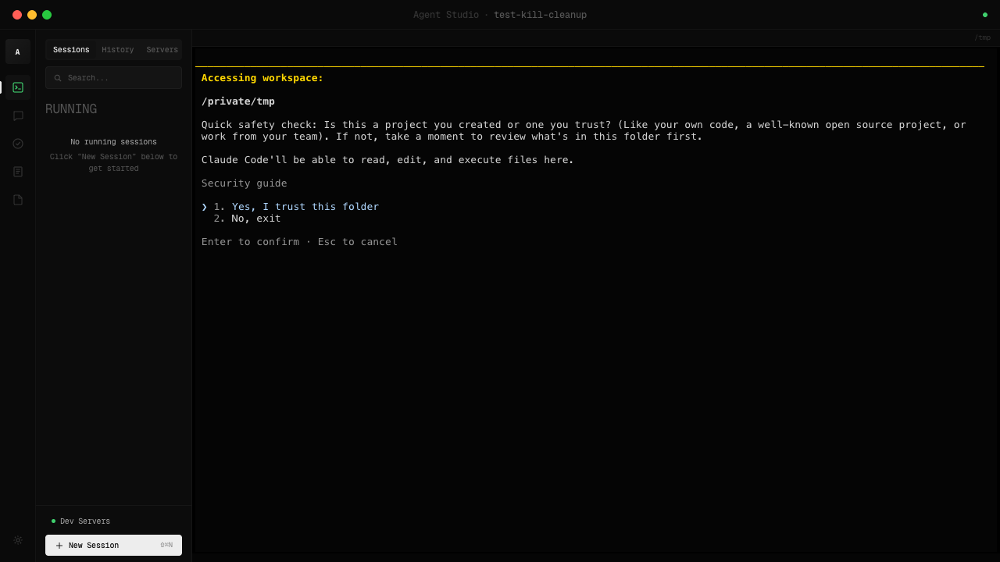
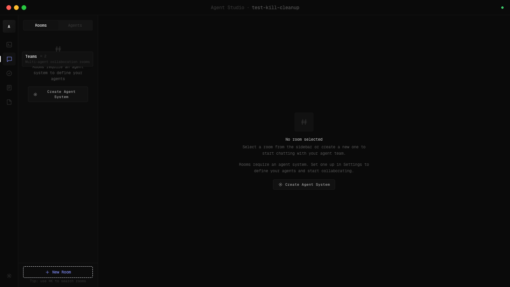
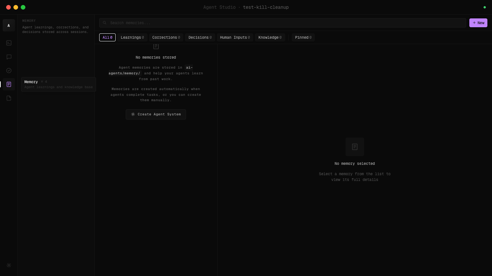
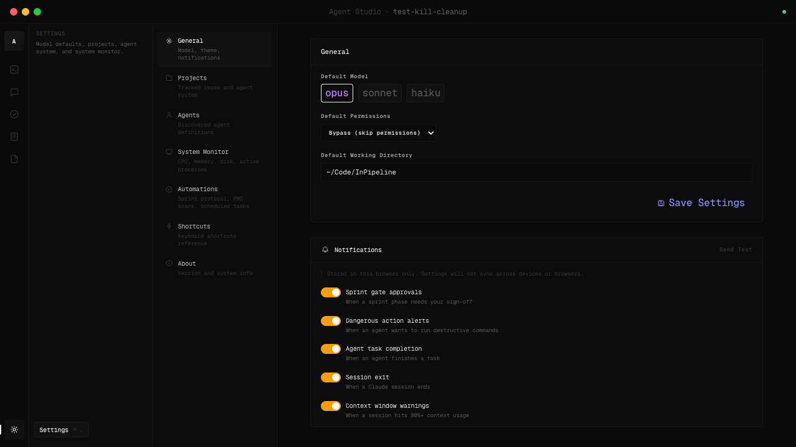
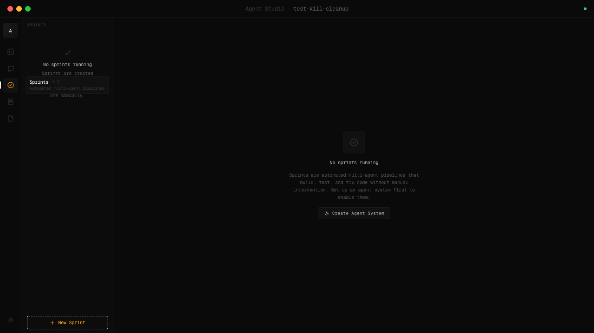

<div align="center">

<br />

# Agent Studio

### One window. Multiple agents. Full control.

<br />

[](LICENSE)
[](https://www.typescriptlang.org)
[](https://nodejs.org)
[](https://github.com/VatsalEnpal/Agent-studio)

</div>

<br />

<div align="center">

</div>

<br />

> You open Claude Code in a terminal. It's great for one task. But when you need a frontend agent, a backend agent, QA, and security review all running at once — you're alt-tabbing between 6 terminals, copy-pasting context, and losing your mind.
>
> Agent Studio puts everything in one place.

<br />

---

<br />

## What you get

<table>
<tr>
<td width="50%">

**Run 6 agents side by side**

Full interactive terminals in a grid. Live stats per session — tokens, cost, context %, model. Launch with presets or configure everything. Resume past sessions. Zoom and fullscreen any pane.

</td>
<td width="50%">

**Agent-to-agent chat rooms**

Agents collaborate through @mentions. One finds the bug, tags another to fix it, a third writes the test. Turn-based protocol keeps things orderly. You approve anything risky.

</td>
</tr>
<tr>
<td width="50%">

**Sprint pipelines with gates**

Multi-step workflows: scan, design, build, test, review, ship. Each step passes, fails, or waits for your approval. Nothing ships without you saying so.

</td>
<td width="50%">

**Shared memory across sessions**

Agents remember what they learn — deploy flags, flaky tests, API quirks. Search, filter, pin entries. Your agents get smarter over time.

</td>
</tr>
</table>

<br />

<div align="center">
<table>
<tr>
<td></td>
<td></td>
</tr>
<tr>
<td align="center"><sub>Agent chat rooms</sub></td>
<td align="center"><sub>Shared knowledge base</sub></td>
</tr>
</table>
</div>

<br />

---

<br />

## Get started

```bash
git clone https://github.com/VatsalEnpal/Agent-studio.git
cd Agent-studio
npm install
npm run dev
```

Open **[localhost:8080](http://localhost:8080)**. A setup wizard scans your project and generates agents tailored to your stack.

**Need the desktop app?** `npm run electron:dev`
**Docker?** `docker build -t agent-studio . && docker run -p 8080:8080 agent-studio`

<br />

---

<br />

## Also included

|                           |                                                                                  |
| ------------------------- | -------------------------------------------------------------------------------- |
| **Git sidebar**           | Auto-detects repos, shows branches + dirty state, commit/push/PR from the UI     |
| **Agent creation wizard** | Scans your project with Claude Code CLI, generates project-specific agents       |
| **Dev server monitor**    | Auto-discovers running dev servers (Next.js, Vite, Express)                      |
| **Automations**           | Scheduled headless Claude Code runs that produce reports                         |
| **Command palette**       | `Cmd+K` to jump anywhere                                                         |
| **Keyboard-first**        | `Cmd+Shift+N` new session, `Cmd+Shift+K` palette, `Tab` cycle panes, `Esc` close |

<br />

<div align="center">
<table>
<tr>
<td></td>
<td></td>
</tr>
<tr>
<td align="center"><sub>Settings — model, permissions, notifications</sub></td>
<td align="center"><sub>Sprint pipelines with approval gates</sub></td>
</tr>
</table>
</div>

<br />

---

<br />

## How it works

```
Electron (optional)  ──  mac shell, tray, crash recovery
Next.js 16 + React 19  ──  UI, state, terminals
Express 5  ──  API, WebSocket, file watchers
node-pty  |  Claude Agent SDK
(terminals)  |  (chat rooms)
```

Two execution modes: **terminal sessions** (real PTY via `node-pty`) for interactive coding, and **room agents** (Claude Agent SDK) for structured collaboration. Both stream over a single WebSocket.

**Stack:** Next.js 16 / React 19 / TypeScript (strict) / Tailwind CSS / Zustand / Express 5 / node-pty / xterm.js / Electron

<br />

---

<br />

## Design

Dark theme. Geist Mono. Amber accent. Minimal chrome, maximum terminal.

Built to be the kind of tool you actually want open all day.

<br />

---

<br />

<div align="center">

**[HOWTO.md](HOWTO.md)** — full user guide &nbsp;&nbsp;|&nbsp;&nbsp; **[ARCHITECTURE.md](ARCHITECTURE.md)** — technical deep-dive &nbsp;&nbsp;|&nbsp;&nbsp; **[CLAUDE.md](CLAUDE.md)** — contributor guide

<br />

Inspired by **[TalkTo](https://github.com/hyperslack/talkto)** — same idea (agents shouldn't work alone), different approach.

<br />

[MIT License](LICENSE)

</div>
