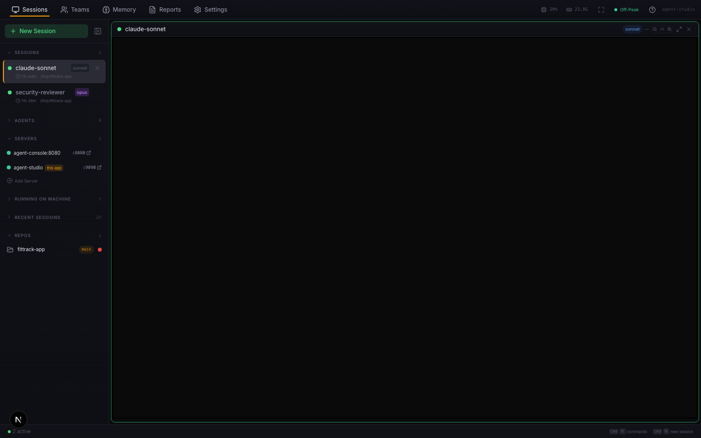
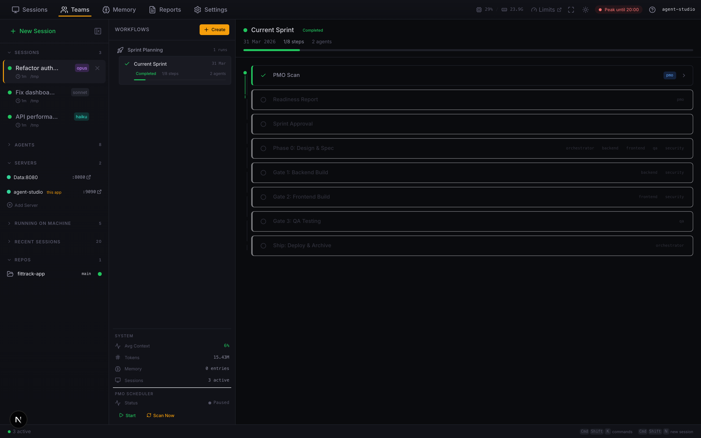
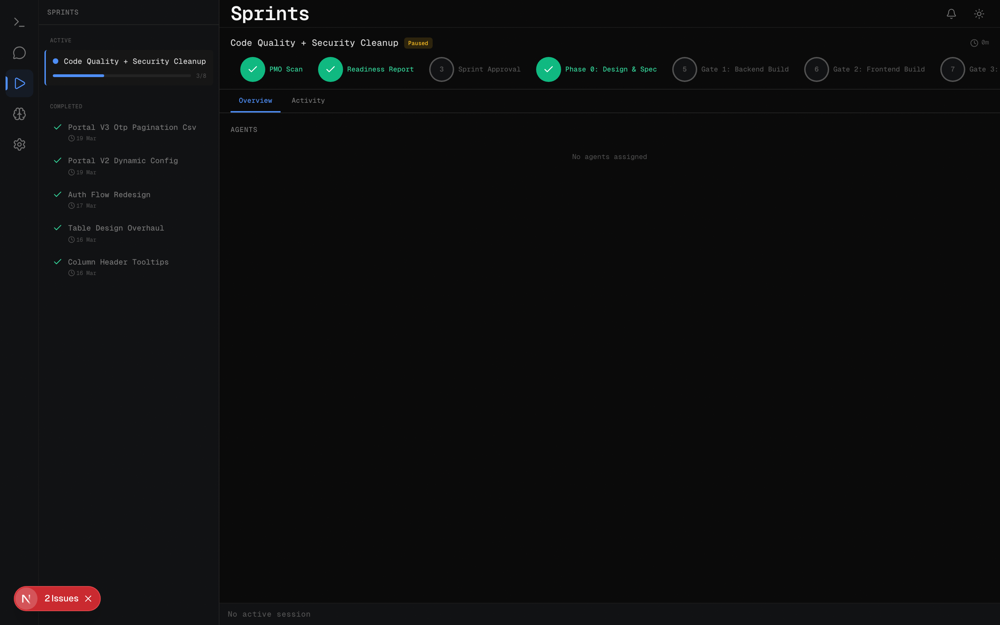
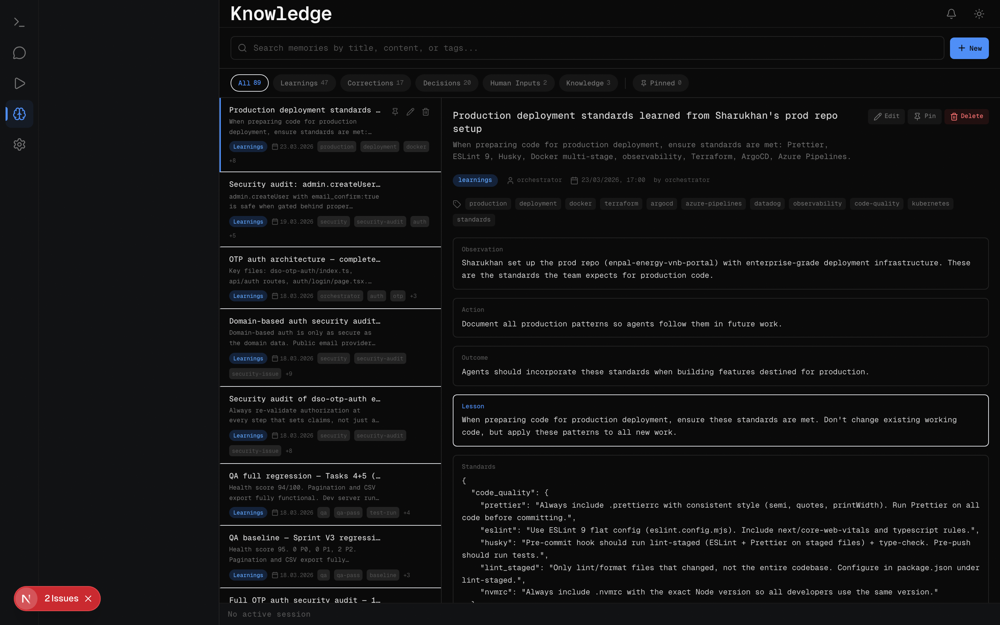
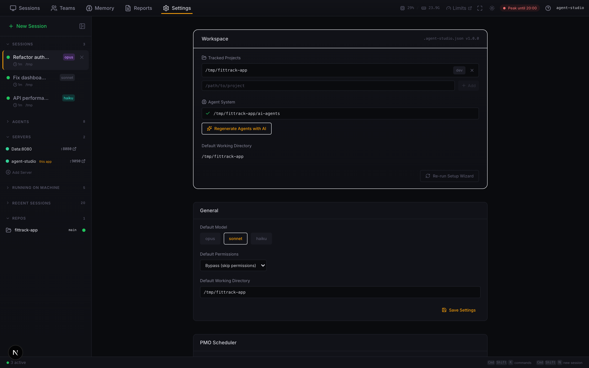

<div align="center">

# Agent Studio

### The engineering manager for your AI coding team.

You run multiple AI agents. They don't talk to each other.<br>
Agent Studio turns them into a real engineering team.

[](LICENSE)
[](https://nodejs.org)
[](https://www.typescriptlang.org)
[](https://www.electronjs.org)
[](https://docs.anthropic.com/en/docs/claude-code)

[Get Started](#getting-started) · [Features](#key-features) · [Architecture](#architecture) · [Compare](#compared-to-alternatives)

</div>

---

<!-- Replace with actual screenshot when available -->


## The Problem

You've got 8 AI agents running across frontend, backend, QA, security, and orchestration. They're all powerful individually. But they don't coordinate. They don't share context. They step on each other's work.

It's like hiring 8 senior engineers and putting them in separate rooms with no Slack, no standups, and no project manager.

## The Solution

Agent Studio gives your AI agents the infrastructure real engineering teams have. Three pillars:

**Team Rooms** — Agents collaborate via @mentions, hand off work, and build on each other's output. One agent finds a bug, another fixes it, a third writes the test. All in structured chat, no terminal noise.

**Autonomous Sprints** — Gate-based workflows that take a feature from planning to production. PMO scans the codebase, design phase produces specs, builders implement, QA validates, security audits. Human approval gates keep you in control.

**Shared Memory** — When one agent discovers that your API needs pagination headers, every agent knows it next session. Learnings, corrections, and architectural decisions persist across the entire team.

---

## Key Features

### Sessions
- Real terminal sessions via `node-pty` + xterm.js with full color, scroll, and zoom
- Live metrics — token count, dollar cost, context window %, model name
- Resume any past session with one click
- Presets — Quick Chat, Start Sprint, Security Audit, or build your own
- `Cmd+K` command palette for instant navigation



### Team Rooms
- Agents collaborate through `@anthropic-ai/claude-agent-sdk`
- @mention routing to specific agents or `@all` broadcast
- Turn-based protocol — one agent at a time, depth limit, no self-loops
- Real-time streaming with typing indicators
- Spawn and tear down agent sessions per room



### Sprint Automation
- Gate-based pipeline: PMO Scan → Readiness → Approval → Design → Build → Test → Security → Ship
- Visual gate stepper with pass/fail/in-progress states
- Sprint history with completion dates and QA scores
- Pause, resume, and cancel with full lifecycle control
- Live state updates via file watching



### Knowledge Base
- Agents write learnings, corrections, and decisions to shared memory
- Search and filter by title, content, tags, or category
- Pin important memories — agents load pinned entries first
- Create and edit entries from the UI or let agents manage them

### Dev Servers
- Auto-detect local development servers running on your machine
- Monitor port status and quick-access links

### Reports & automations
- Scheduled headless Claude Code runs (automations) with output saved as **reports**
- Review, approve, or dismiss reports from the **Reports** tab (top toggle)
- Configure schedules and templates under **Settings → Automations**

### Desktop App (macOS)
- **Native Mac app** built with Electron — menu bar, traffic lights, and OS integration
- Native macOS notifications for gate approvals, dangerous actions, task completion
- System tray with quick controls
- Crash recovery and health watchdog
- Keyboard shortcuts throughout (`Cmd+K`, `Cmd+N`, `Cmd+1-5`)



### Settings & Git
- Auto-discovered agents from `.claude/agents/`
- Multi-repo git status with branch, dirty state, PR creation
- System monitor (CPU, RAM, disk, WebSocket connections)
- Default model, permissions, and working directory config
- Notification preferences per event type

---

## Compared to Alternatives

| | **Agent Studio** | **Multiple terminals** | **Other dashboards** |
|---|---|---|---|
| Agent collaboration | Team rooms with @mentions, turn protocol | Copy-paste between tabs | Isolated sessions |
| Autonomous workflows | Gate-based sprints with human approval | Manual coordination | Basic task queues |
| Shared memory | Persistent knowledge base across sessions | None | None |
| Real terminals | Full PTY with color, scroll, cost tracking | Yes, but no metrics | Web-only, limited |
| Desktop app | Native Mac app, notifications, tray | Terminal emulator | Browser tab |
| Sprint visualization | Gate stepper, history, QA scores | `tail -f` a log file | Varies |

---

## Getting Started

**Use the `main` branch** (default when you clone). Everything you need is there.

```bash
git clone https://github.com/VatsalEnpal/Agent-studio.git
cd Agent-studio
npm install
npm run electron:dev    # Mac desktop app + dev server (wait for server, then Electron opens)
# or: npm run dev       # browser only → http://localhost:8080
```

In-app walkthrough: [HOWTO.md](HOWTO.md) (features, shortcuts, agents, automations).

### Prerequisites

- **macOS** for the Electron app (the UI also works in a browser on other OSes)
- **Node.js 22+**
- **Claude Code CLI** authenticated — [install guide](https://docs.anthropic.com/en/docs/claude-code)

On first launch, Agent Studio checks prerequisites and runs onboarding if everything passes.

### Build a `.dmg` (optional)

```bash
npm run build:mac
```

---

## Architecture

```
Electron shell  ←→  Express 5 server  ←→  Claude Code CLI (node-pty)
                         ↕                         ↕
                    Next.js 16 UI         Claude Agent SDK (rooms)
```

| Layer | Stack | Role |
|-------|-------|------|
| **Frontend** | Next.js 16, React 19, Tailwind CSS, Zustand, xterm.js | UI, state management, terminal rendering |
| **Server** | Express 5, WebSocket (ws), node-pty, chokidar | API, PTY management, file watching, agent orchestration |
| **Rooms** | `@anthropic-ai/claude-agent-sdk` | Structured agent chat, turn protocol |
| **Desktop** | Electron | Native shell, notifications, tray, crash recovery |

---

## Project Structure

```
server/                  Express backend
  index.ts               Main server — API routes, WebSocket, session lifecycle
  sdk-session.ts         Claude Agent SDK session manager (rooms)
  terminal-manager.ts    PTY lifecycle, kill escalation, readiness detection
  rooms.ts               Room state, persistence, context files
  routes/                API route modules
    sessions.ts            Session CRUD, spawn, kill
    rooms.ts               Room chat, agent management
    memory.ts              Knowledge base API
    sprint.ts              Sprint lifecycle
    git.ts                 Git status, PR creation
    settings.ts            Configuration
    health.ts              Health check
    system.ts              System metrics
  managers/              Process tracker, conversation protocol, sprint manager
  workflows/             Sprint planning engine

src/                     Next.js frontend
  app/                   Pages and layouts
  components/
    sessions/            Session cards, launcher, sidebar, presets
    teams/               Room chat, agent list, workflow builder
    sprints/             Sprint detail, gate stepper, activity log
    memory/              Knowledge base CRUD
    settings/            Configuration panels
    dev-servers/         Local server monitoring
    terminal/            Terminal grid and pane components
    layout/              Sidebar, command palette, help panel, toggle bar
    ui/                  Shared primitives — nav rail, status bar, toasts, icons
  stores/                Zustand state (sessions, rooms, sprints, memory, UI, git)
  hooks/                 Keyboard shortcuts, notifications, config, theme, usage
  lib/                   WebSocket client, design tokens, types, utilities
  styles/                Global CSS

electron/                Desktop app shell
  main.js                Main process — server lifecycle, crash recovery, tray
  preload.js             IPC bridge for native notifications

docs/                    Design specs and research
```

---

## Tech Stack

| Category | Technology |
|----------|-----------|
| Framework | Next.js 16, React 19 |
| Language | TypeScript (strict mode) |
| Styling | Tailwind CSS |
| State | Zustand 5 |
| Server | Express 5 |
| Terminal | node-pty, xterm.js |
| AI | Claude Agent SDK, Claude Code CLI |
| Desktop | Electron |
| WebSocket | ws |
| File watching | chokidar |
| Build | esbuild, electron-builder |
| Testing | Vitest, Playwright, supertest |
| Validation | Zod |

---

## Development

```bash
npm run dev              # Dev server with hot reload (localhost:8080)
npm run electron:dev     # Dev server + Electron together (macOS GUI)
npm run type-check       # TypeScript strict mode check
npm run test             # Vitest unit tests
npm run test:smoke       # Endpoint + WebSocket smoke test
npm run build:mac        # Build macOS .dmg
```

---

## Contributing

1. Fork and clone; stay on **`main`** or branch from it
2. `npm run type-check` and `npm run test` before you PR
3. Open a pull request into `main`

---

## License

[MIT](LICENSE)

---

<div align="center">

Built by [Vatsal](https://github.com/VatsalEnpal) — for teams that run AI agents on real production codebases.

</div>
